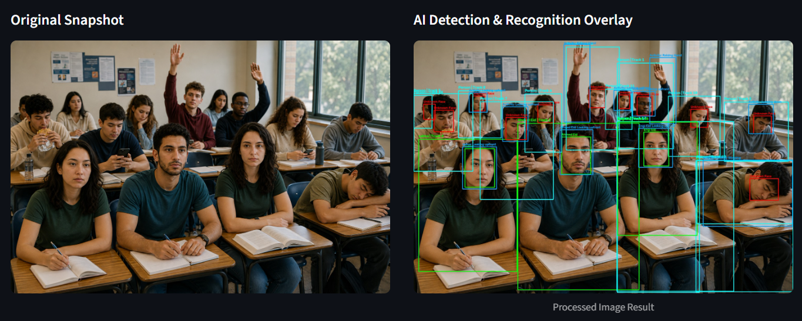

# Nabehni | نبهني 🎓

> **An AI-powered Smart Classroom Monitoring System for Student Identification, Attendance Tracking, and Classroom Activity Detection.**

Nabehni (نبهني) is a Computer Vision system designed to analyze classroom images and videos, identify registered students, record attendance, and detect classroom activities/events using deep learning models.

The system combines **YOLOv8 person detection and tracking**, **InsightFace face recognition**, and a custom **YOLO event-detection model (`best.pt`)** into a single processing pipeline. Detected identities, attendance records, and classroom events are stored in an SQLite database.

---

## ✨ Key Features

- 👤 **Student Detection**
  - Detects people in classroom scenes using YOLOv8n.
  - Uses ByteTrack to maintain persistent person identities across video frames.

- 🧑‍💻 **Face Recognition**
  - Uses InsightFace with the `buffalo_l` model.
  - Extracts face embeddings from registered student images.
  - Supports multiple images per student and can calculate an average embedding.
  - Uses cosine similarity with a configurable similarity threshold.

- ✅ **Automatic Attendance**
  - Associates recognized students with tracked persons.
  - Records attendance with student ID, class ID, timestamp, status, and confidence.

- 🎯 **Classroom Event Detection**
  - Uses the custom-trained `best.pt` YOLO model to detect classroom activities/events.
  - Associates detected events with the corresponding student/person.

- ⏱️ **Temporal Event Tracking**
  - Maintains events across multiple video frames.
  - Records event start and end times instead of treating every frame as a separate event.

- 🖼️ **Image Processing**
  - Processes classroom images for student recognition, attendance, and event detection.
  - Produces an annotated image showing detections and recognized students.

- 🎥 **Video Processing**
  - Processes classroom videos frame by frame.
  - Tracks students using ByteTrack.
  - Performs periodic face recognition.
  - Detects and records classroom events.
  - Produces an annotated processed video.

- 📊 **Dashboard / GUI**
  - Provides a graphical interface for adding students, processing media, and viewing classroom information and results.

---

## 🧠 System Architecture

The main video-processing pipeline follows this flow:

```text
                    Input Image / Video
                            │
                            ▼
                YOLOv8n Person Detection
                            │
                            ▼
                    ByteTrack Tracking
                            │
                            ▼
                 Persistent Track IDs
                            │
                            ▼
                    Face Recognition
                    (InsightFace)
                            │
                            ▼
                Track ID → Student ID
                            │
                ┌───────────┴───────────┐
                ▼                       ▼
        Attendance Recording      Event Detection
                                        │
                                        ▼
                              Custom YOLO Model
                                  (best.pt)
                                        │
                                        ▼
                             Object → Person
                                Association
                                        │
                                        ▼
                              Temporal Events
                                        │
                         ┌──────────────┴──────────────┐
                         ▼                             ▼
                  Attendance DB                  Events DB
                         │                             │
                         └──────────────┬──────────────┘
                                        ▼
                              Annotated Output
```

The implemented `VideoProcessor` explicitly follows this computer-vision pipeline, from person detection and tracking through face recognition, event detection, temporal event handling, database recording, and processed output. 

---

## 🏗️ Project Structure

```text
Nabehni/
│
├── core/
│   ├── face_engine.py
│   └── video_processor.py
│
├── CV_INV/
│
├── data/
│   └── student_images/
│
├── gui/
│   ├── add_student.py
│   ├── app.py
│   └── dashboard.py
│
├── db.sqlite3
│
├── database.py
├── main.py
│
├── best.pt
├── yolov8n.pt
│
├── Event Detection Model...
│
├── test_photo1.png
├── test_video1.mp4
│
├── .gitignore
├── requirements.txt
└── README.md
```

### Main Components

| Component | Description |
|---|---|
| `core/face_engine.py` | Face detection, embedding extraction, normalization, and face recognition |
| `core/video_processor.py` | Main image/video Computer Vision pipeline |
| `database.py` | Database connection and attendance/event operations |
| `db.sqlite3` | SQLite database containing students, images, classes, attendance, and events |
| `gui/add_student.py` | Student registration functionality |
| `gui/app.py` | Main application interface |
| `gui/dashboard.py` | Dashboard and result visualization |
| `main.py` | Application entry point |
| `best.pt` | Custom YOLO model for classroom event/activity detection |
| `yolov8n.pt` | YOLOv8n model used for person detection |
| `data/student_images/` | Stored student images |
| `test_photo1.png` | Validation image |
| `test_video1.mp4` | Validation video |

---

## 👤 Face Recognition Engine

The face-recognition component uses **InsightFace `buffalo_l`** with the CPU execution provider by default.

For a registered student, multiple valid face embeddings can be processed and an average normalized embedding can be generated. During recognition, the current face embedding is normalized and compared against the known embeddings using cosine similarity.

The default similarity threshold is:

```text
sim_threshold = 0.5
```

A face is recognized only when its best similarity score reaches or exceeds the configured threshold.

The implementation also handles invalid images and cases where no face is detected without crashing the pipeline.

---

## 🎥 Video Processing

The video processor combines several Computer Vision stages.

### 1. Person Detection & Tracking

YOLOv8n detects full-body persons, while **ByteTrack** provides persistent tracking IDs across frames.

```python
self.person_model.track(
    frame,
    persist=True,
    tracker="bytetrack.yaml"
)
```

### 2. Periodic Face Recognition

Face recognition is performed periodically rather than necessarily on every frame. The recognized student is associated with the corresponding tracked person.

This reduces unnecessary repeated face-recognition operations while preserving the identity of tracked students.

### 3. Attendance

When a student is successfully recognized, the system records:

- Student ID
- Class ID
- Attendance status
- Timestamp
- Recognition confidence

The system also prevents repeatedly inserting attendance for the same recognized student during a single processing session.

### 4. Event Detection

The custom `best.pt` YOLO model detects classroom activities/events.

Detected objects are associated with the most likely tracked person using spatial relationships such as:

- Bounding-box overlap
- Object center position
- Distance between object and person
- Person bounding-box geometry

### 5. Temporal Event Engine

Instead of recording an event independently on every frame, the processor maintains an active event state.

An event receives:

- Event type
- Student/track identity
- Start time
- Last-seen frame
- Confidence
- Bounding box

When the event is no longer detected for the configured buffer period, the event is closed and stored in the database.

---

## 🗄️ Database Architecture

The project uses **SQLite** through `db.sqlite3`.

The database contains the following main entities:

```text
Subjects
   │
   ▼
Classes ───────────────► Student_Events
   │                           ▲
   │                           │
   ▼                           │
Attendance ◄──────── Students ─┘
                 │
                 ▼
          Student_Images
```

### Database Tables

#### `Students`

Stores registered students.

```text
Stu_ID
Name
```

#### `Student_Images`

Stores images and face embeddings associated with students.

```text
Image_ID
Stu_ID
Image_Path
Face_Embedding
```

#### `Subjects`

Stores subjects/classes' subject information.

```text
Sub_ID
Name
```

#### `Classes`

Represents classes and connects them to subjects.

```text
Class_ID
Sub_ID
```

#### `Attendance`

Stores student attendance records.

```text
Attend_ID
Stu_ID
Class_ID
Status
Timestamp
Confidence
```

#### `Student_Events`

Stores detected classroom activities/events.

```text
Event_ID
Stu_ID
Class_ID
Event_Type
Start_Time
End_Time
Confidence
```

---

## 🔄 Recognition & Association Strategy

Nabehni uses several levels of association:

```text
Face
 │
 ▼
Student Identity
 │
 ▼
Person Track
 │
 ▼
Detected Object / Activity
 │
 ▼
Student Event
```

This allows the system to move beyond simple object detection and connect a detected classroom activity to a specific registered student.

For example:

```text
Detected Person
      ↓
Face Recognition
      ↓
Student: Engi
      ↓
Track ID: 12
      ↓
Detected Event: Phone
      ↓
Database Event:
Engi → Phone → Start Time → End Time → Confidence
```

---

## 🖥️ Application Workflow

### Student Registration

```text
Add Student
     ↓
Enter Student Information
     ↓
Upload / Capture Student Images
     ↓
Extract Face Embeddings
     ↓
Store Images + Embeddings
     ↓
Student Available for Recognition
```

### Classroom Analysis

```text
Upload Image / Video
          ↓
     Person Detection
          ↓
       Tracking
          ↓
   Face Recognition
          ↓
  Student Identification
          ↓
    Attendance Record
          ↓
    Event Detection
          ↓
 Student ↔ Event Association
          ↓
      Event Recording
          ↓
    Annotated Output
```

---

## 🧪 Validation

The project includes dedicated validation media.

### Validation Image

The following image is included as a validation example:



**File:** `test_photo1.png`

The image-processing pipeline can detect persons, recognize known students, annotate detected faces/persons, and detect supported classroom events.

### Validation Video

A validation video is also included:

**File:** [`test_video1.mp4`](test_video1.mp4)

The video-processing pipeline applies:

- Person detection
- ByteTrack tracking
- Periodic face recognition
- Student-track association
- Attendance recording
- Custom event detection
- Temporal event handling
- Annotated video generation

---

## ⚙️ Technologies Used

| Technology | Purpose |
|---|---|
| **Python** | Main programming language |
| **OpenCV** | Image/video processing and visualization |
| **YOLOv8** | Person and event/object detection |
| **Ultralytics** | YOLO model implementation |
| **ByteTrack** | Multi-object tracking |
| **InsightFace** | Face detection and face embeddings |
| **NumPy** | Numerical operations and embedding processing |
| **SQLite** | Local database |
| **Streamlit / GUI components** | Application interface |

---

## 📦 Installation

### 1. Clone the repository

```bash
git clone <YOUR_REPOSITORY_URL>
cd Nabehni
```

### 2. Create a virtual environment

Windows:

```bash
python -m venv venv
venv\Scripts\activate
```

Linux / macOS:

```bash
python3 -m venv venv
source venv/bin/activate
```

### 3. Install dependencies

```bash
pip install -r requirements.txt
```

### 4. Make sure the required model files are available

The project expects:

```text
yolov8n.pt
best.pt
```

The custom `best.pt` model is used for classroom event detection, while `yolov8n.pt` is used for person detection.

---

## ▶️ Running the Project

Depending on the configured application entry point, run:

```bash
python main.py
```

or, if the GUI is launched through the application module:

```bash
streamlit run gui/app.py
```

---

## 🧩 Configuration

The main video-processing configuration includes:

```python
person_model_path = "yolov8n.pt"
event_model_path = "best.pt"
sim_threshold = 0.5
face_recognition_interval = 5
track_conf = 0.25
event_buffer_frames = 15
```

### Parameter Overview

| Parameter | Purpose |
|---|---|
| `person_model_path` | YOLO model used for person detection |
| `event_model_path` | Custom YOLO model used for event detection |
| `sim_threshold` | Minimum face similarity required for recognition |
| `face_recognition_interval` | Number of frames between face-recognition operations |
| `track_conf` | Person-detection confidence threshold |
| `event_buffer_frames` | Number of frames used to keep an event active after it disappears |

---

## 💻 CPU Support

The face-recognition engine is configured to use:

```python
['CPUExecutionProvider']
```

by default, allowing the project to run on systems without a dedicated NVIDIA GPU.

GPU acceleration can be configured through the model/provider setup when compatible hardware and dependencies are available.

---

## 📈 Output

The system generates annotated results containing visual information such as:

- 👤 Person bounding boxes
- 🆔 Student names
- 🎯 Track IDs
- 🙂 Face bounding boxes
- 🎬 Detected classroom activities
- 📊 Detection/recognition confidence

At the same time, structured attendance and event information is stored in the SQLite database.

---

## 🔐 Data & Privacy

The project processes student facial images and face embeddings. These are sensitive biometric-related data in practical deployments.

For real-world usage:

- Store student data securely.
- Restrict access to the database and image directory.
- Obtain appropriate consent before collecting facial data.
- Follow applicable privacy and data-protection regulations.
- Avoid exposing student images or embeddings publicly.

---

## 👥 Authors

- **Engi Eid Abdelfattah**
- **Abrar Ashraf Shaaban**
- **Sarah Gamal Ahmed**
- **Rania Sabry Omran**

---

## 📌 Project Summary

**Nabehni | نبهني** combines face recognition, object detection, multi-object tracking, and database management to build an intelligent classroom monitoring system.

Its main goal is to transform classroom visual data into structured information:

```text
Classroom Media
      ↓
Computer Vision
      ↓
Student Identification
      ↓
Attendance
      ↓
Activity / Event Detection
      ↓
Temporal Analysis
      ↓
Structured Database
      ↓
Dashboard & Reports
```

---

## ⭐ Nabehni | نبهني

**Smart Classroom Monitoring through Computer Vision and AI**

> Detect • Recognize • Track • Analyze
